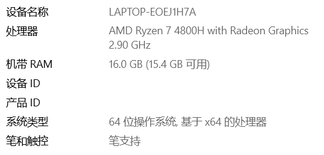

#CS307 Project2

## Members

Team of 12010903林雨航, 12012338曾宪清 in Lab 2.

|              |                     林雨航                     |                    曾宪清                     |
| :----------: | :--------------------------------------------: | :-------------------------------------------: |
|    Basic     | function 2~5  funtion 13 one step export | function 1 function 6~12 one step input |
| enhance APIs |                   8 new APIs                   |                                               |
| better query |                                                |      basic functions accept no parameter      |
|  front-end   |                                                |   using flask in python with http protocol    |
|     GUI      |                                                |      show all functions on website page       |
|     pool     |                                                |             apply connection pool             |
|  privilege   |      different for top, salesman, manager      |                                               |
|    score     |                      50%                       |                      50%                      |
|   hardware   |                           |                          |
|    python    |                      3.10                      |                     3.6.3                     |

Python packet used:

|   packet name   | version |
| :-------------: | :-----: |
| Flask-Bootstrap | 3.3.7.1 |
|    Flask-WTF    |  1.0.1  |
|      Flask      |  2.1.2  |
|    psycopg2     |  2.9.3  |
|     WTForms     |  3.0.1  |

## Basic API

>**importFour()**
Import four information files in one function

>**stockIn()**
Support action of increasing the product inventory according to .csv file

>**placeOrder()**
Place an order which sells specific products to an enterprise according to .csv file

>**updateOrder()**
Update orders in a series of limitations according to .csv file.

>**deleteOrder()**
Delete orders following a series of limitations according to .csv file. No contract delete if order do not exist.

>**getAllStaffCount()**
Return the numbers of people for all types of staffs.

>**getContractCount()**
Return the total number of existing contract.

>**getOrderCount()**
Return the total number of existing orders.

>**getNeverSoldProductCount()**
Return the number of models that are in stock but have never been ordered.

>**getFavoriteProductModel()**
Find the models with the highest sold quantity, and the number of sales.

>**getAvgStockByCenter()**
Calculate the average quantity of the remaining product models for each supply center.

>**getProductByNumber(model_number: str)**
> - model_number: a number of specific model
> 
> According to input model number, Return the current inventory capacity of each product model in each supply center.

>**getContractInfo(contract_number: str)**
> - contract_number: a specific number of a contract.
> 
> Return specific contract information in requirements of a specified contract.

>**oneStepExport(product_number_list: list[str], contract_number_list: list[str])**
> - product_number_list: list of input parameters in `getProductByNumber`.
> - contract_number_list: list of input parameters in `getContractInfo`.
> 
> Export required information into local file.

## Advanced APIs

> **getBestSalesman(type: str)**
> - type: can be one of three strings: 'amount', 'model', and 'order'.
> 
> - if type == 'amount':
> &emsp;&emsp;Return the id and name of salesman selling out most money.
> if type == 'model:
> &emsp;&emsp;Return the id and name of salesman selling out most model number.
> else: (type == 'order' or something else)
> &emsp;&emsp;Return the id and name of salesman selling out most order number.
> - Set one more prize in year-end bonus.

> **getBestProfitProductModel()**
> - Consider if all models are sold out, return the model name, profit, and remain storage product number. If there are paralleling models, show them all.
> 
> - Offer advice on selling strategy: try to sell all output model out.

> **getOrderBetweenDates(date1: str, date2: str, enterprise: str, contract_num: str)**
> - date1: in format "year-month-day"
> date2: in format "year-month-day"
> enterprise: the name of client enterprise. Can be empty, regard wrong input as empty.
> contract_num: the number of specific contract. Can be empty, regard wrong input as empty.
>
> - Return all orders (in this client enterprise) (in this contract) between two input days.
>
> - To prevent client blackmail company, and offer a query function for employees.

> **getMostModelEnterpriseRecent()**
> - Return the first ten enterprise name making deals with company most frequent.
> - Every year to find an excuse to send small gifts to enhance the relationship, stimulate customers to spend more money.

> **getLossProductModel()**
> - Return all negative profit model in all already sold-out models, and the model having not been ordered in one year after stock in.
> - These model do not have sales market, consider stock in less or none of them in future.

> **getOrderEachMonth(center: str)**
> - center: Can be empty, regard wrong input as empty.
> - Return the number of orders in every months (in a specific supply center). An order is consider to be done if and only if its contract type is "Finished".
> - Top handlers in company can adjust human resource to each supply center, move some employees from less-ordered-center to more-ordered-center.

> **getProfitBetweenDates(date1: str, date2: str)**
> - date1: in format "year-month-day"
>   date2: in format "year-month-day" 
> - Return cure profit between two days of whole company.
> - To query bills and profit.

> **setNowDate(date: str)**
> - date: in format "year-month-day"
> - Set present date into specific date. All contract finished after this day will be set "contract_type" into "Unfinished". All contract finished on or before this day will be set "contract type" into "Finished".
> - To simulate natural time flow in reality.

## Other advanced points

### User privilege

Three privileges are designed.

- Salesman: Start with character 's' followed by salesman's number. Like 's12010001'. Can only query orders belonging to him/her.
- Contract manager: Start with character 'c' followed by manager's number. Like 'c12010001'. Can only query orders belonging to his/her contract, and contracts belonging to him/her.
- Top user: Start with character 't' followed by a serial number. Like 't123123'. Designed for senior executive in company, have all privileges.

Respective APIs are as follows:

> **addSalesmanUser(salesman_num: str)**
> - salesman_num: a staff number of one salesman.
>  - Add a user for this salesman, the name of user is created by adding character 's' before this number. If this salesman is already has privilege, do nothing.

> **addManagerUser(manager_num: str)**
> - manager_num: a staff number of one contract manager.
>  - Add a user for this manager, the name of user is created by adding character 'c' before this number. If this manager is already has privilege, do nothing.

> **addTopUser(user_number: str)**
> - user_number: a serial number of one executive.
>  - Add a user for this executive, the name of user is created by adding character 't' before this number. If this executive is already has privilege, do nothing.

> **changeUser(user_name)**
> - user_name: a user's name
> - Change privilege into input user. If this user name do not exist, then do nothing. This function is used to simulate human resource management system in company.

### Back-end server

展示http协议通信

### Connection pool

数据库连接池

### GUI

GUI设计